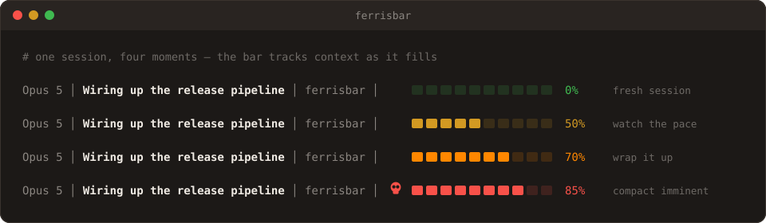
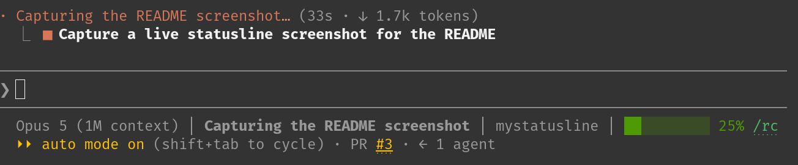

<p align="center">
  <picture>
    <source media="(prefers-color-scheme: dark)" srcset="assets/header-dark.svg">
    
  </picture>
</p>

<p align="center">
  <a href="https://github.com/kerryhatcher/ferrisbar/actions/workflows/ci.yml"></a>
  <a href="https://crates.io/crates/ferrisbar"></a>
  <a href="#-license"></a>
  <a href="https://www.rust-lang.org"></a>
  <a href="https://github.com/kerryhatcher/ferrisbar/issues"></a>
</p>

**ferrisbar** renders the [Claude Code](https://claude.com/claude-code)
statusline — your model, the task you are on *right now*, the directory, and a
context-window gauge that runs green → yellow → orange → blinking red before
auto-compaction hits.

<p align="center">
    
</p>

<p align="center">
    
</p>

<p align="center">
  <sub>The bottom line is ferrisbar, in a real session.</sub>
</p>

## ✨ Features

- **📊 A context gauge that means something** — the bar reports how much of
  your *usable* window is gone, not the raw token count.
  [Here is why those differ](#-why-ferrisbar).
- **🎯 Shows your current task** — reads the
  [task list](https://docs.claude.com/en/docs/claude-code/overview) Claude Code
  maintains while it works and surfaces the one item marked `in_progress`, so
  the line says what the agent is *doing*, not just where it is. Claude Code
  2.1.220 moved where it keeps those files, so this segment does not currently
  appear on recent versions —
  [#4](https://github.com/kerryhatcher/ferrisbar/issues/4) tracks the fix.
- **🚦 Escalating urgency** — [green](#-configuration) under 50%, yellow to
  65%, orange to 80%, then a blinking red bar with a 💀 so you notice before
  you get compacted.
- **⚡ Fast and dependency-light** — one [Rust](https://www.rust-lang.org)
  binary and four runtime crates ([serde](https://serde.rs) and
  [serde_json](https://docs.rs/serde_json) for the payload,
  [toml](https://docs.rs/toml) for the [config file](#-configuration),
  [flate2](https://docs.rs/flate2) for log rotation). No interpreter to start
  on every single prompt render.
- **🔧 One-command wiring** — [`ferrisbar setup`](#wiring-it-into-claude-code)
  edits your settings in place and preserves every other key.
- **🛡️ Never breaks your prompt** — partial or wrong-typed JSON
  [drops just the affected segment](#-reference-the-input-contract), and input
  that is not JSON at all prints nothing and exits `0`. Neither path puts a
  stack trace in your prompt.

## 🚀 Quick Start

```bash
cargo install ferrisbar
ferrisbar setup
```

Start a new [Claude Code](https://claude.com/claude-code) session and the
statusline is live. Claude Code reads `statusLine` once at session start, so an
already-running session will not pick it up.

## 📖 Contents

- [Why ferrisbar](#-why-ferrisbar)
- [Installation](#-installation)
- [Usage](#-usage)
- [Configuration](#-configuration)
- [Reference: the input contract](#-reference-the-input-contract)
- [Contributing](#-contributing)
- [Getting help](#-getting-help)
- [License](#-license)
- [Acknowledgements](#-acknowledgements)

## 🤔 Why ferrisbar

**The number Claude Code hands you is not the number you care about.** The
payload reports `remaining_percentage` against the *whole* context window, but
you never get to spend the whole window — [auto-compaction][compact] fires
while a buffer is still unused. A raw "42% left" reading is quietly
optimistic, and it is optimistic by a different amount on every model.

ferrisbar rescales against the space you can actually spend. It subtracts the
auto-compaction buffer (16.5% by default, or exactly what you tell it via
[`CLAUDE_CODE_AUTO_COMPACT_WINDOW`](#-configuration)) and reports the rest, so
`100%` means *"you are at the compaction floor"* rather than *"the window is
literally empty."* When the bar goes red you have a few messages left to land
the plane — not zero.

The rest follows from wanting that on screen during every single render:

|                    | Shell-script statusline | ferrisbar                |
| ------------------ | ----------------------- | ------------------------ |
| Cost per render    | fork + interpreter      | one static binary        |
| Bad/partial JSON   | usually a stack trace   | degrades to a short line |
| Current task shown | rarely                  | yes, from Claude's tasks |
| Runtime deps       | [jq], python, bash…     | none                     |

[compact]: https://docs.claude.com/en/docs/claude-code/costs
[jq]: https://jqlang.github.io/jq/

## 📦 Installation

Every route needs a Rust toolchain, and ferrisbar builds on **Rust 1.85.1 or
newer** — a floor CI re-checks on every commit by running the whole test suite
against that exact toolchain, so a stale toolchain fails loudly rather than
mysteriously. The usual way, which drops the binary at
`~/.cargo/bin/ferrisbar`:

```bash
cargo install ferrisbar
```

No `cargo` yet? [rustup](https://rustup.rs) sets up the whole toolchain in one
step, and the [CI workflow](.github/workflows/ci.yml) shows exactly which
versions are exercised.

<details>
<summary><b>Other installation routes</b></summary>

<br>

**Straight from `main`**, if you want changes before they are released:

```bash
cargo install --git https://github.com/kerryhatcher/ferrisbar
```

**From a local clone**, which is also what you want for
[hacking on it](CONTRIBUTING.md):

```bash
git clone https://github.com/kerryhatcher/ferrisbar.git
cd ferrisbar
cargo install --path .
```

**Pinned to an exact version**, using any tag from
[the releases page](https://github.com/kerryhatcher/ferrisbar/releases):

```bash
cargo install ferrisbar --version 0.2.0
```

Prebuilt binaries for Linux, macOS, and Windows are attached to
[every release](https://github.com/kerryhatcher/ferrisbar/releases/latest) if
you would rather not compile anything.

</details>

Verify the binary before wiring it into anything:

```bash
echo '{"model":{"display_name":"Claude"},"workspace":{"current_dir":"/tmp"}}' \
  | ferrisbar
```

That prints `Claude │ tmp`, dimmed. Claude Code sends a far richer payload at
runtime — see [the input contract](#-reference-the-input-contract).

## 🛠 Usage

ferrisbar has exactly two modes: wire itself up, or render a line.

### Wiring it into Claude Code

```bash
ferrisbar setup             # writes ~/.claude/settings.json
ferrisbar setup --project   # writes ./.claude/settings.local.json
```

Either command points `statusLine.command` at the binary's absolute path and
rewrites nothing else — every other key in the file survives, and the file is
created if it does not exist. Use `--project` to enable ferrisbar in one
repository without touching your user-level
[settings](https://docs.claude.com/en/docs/claude-code/settings).

Prefer to edit the settings yourself? It is one key:

```json
{
  "statusLine": {
    "type": "command",
    "command": "/home/you/.cargo/bin/ferrisbar"
  }
}
```

### Rendering a line

With no arguments, ferrisbar reads one [JSON](https://www.json.org) payload on
stdin and writes one statusline to stdout. That is the entire contract, which
makes it easy to inspect by hand:

```bash
echo '{
  "model": {"display_name": "Opus 5"},
  "workspace": {"current_dir": "/home/you/projects/ferrisbar"},
  "session_id": "abc123",
  "context_window": {"remaining_percentage": 41.55, "total_tokens": 1000000}
}' | ferrisbar
```

Segments appear in this order, and each one disappears when it has nothing to
say:

```text
Opus 5 │ Wiring up the release pipeline │ ferrisbar │ ███████░░░ 70%
  ↑                    ↑                      ↑              ↑
model            active task              directory     context gauge
```

## 🧰 Configuration

ferrisbar reads an optional TOML config file, creating it with the defaults
below the first time it runs. Environment variables override anything set
in the file.

### Where things live

| | Linux | macOS | Windows |
|---|---|---|---|
| Config | `$XDG_CONFIG_HOME/ferrisbar/config.toml`, else `~/.config/ferrisbar/config.toml` | `~/Library/Application Support/ferrisbar/config.toml` | `%APPDATA%\ferrisbar\config.toml` |
| Log | `$XDG_DATA_HOME/ferrisbar/logs/`, else `~/.local/share/ferrisbar/logs/` | `~/Library/Application Support/ferrisbar/logs/` | `%LOCALAPPDATA%\ferrisbar\logs\` |

### The config file

```toml
[log]
enabled        = true
level          = "warn"    # "off" | "warn" | "debug"
path           = ""        # "" = <data dir>/logs/ferrisbar.jsonl
max_size_bytes = 1048576   # rotate at 1 MiB
max_archives   = 7         # keep .1.gz … .7.gz

[claude]
config_dir          = ""   # "" = $CLAUDE_CONFIG_DIR, else ~/.claude
auto_compact_window = 0    # 0 = use the built-in 16.5% buffer

[display]
bar_width          = 10
threshold_yellow   = 50
threshold_orange   = 65
threshold_critical = 80
show_task          = true
```

A relative `log.path` resolves against the data directory, not the
directory you happen to be in.

`threshold_yellow`, `threshold_orange`, and `threshold_critical` must be
strictly increasing; if they are not, all three fall back to the defaults
above. `bar_width` clamps to `1..=100`. `show_task` set to `false` hides the
active-task segment entirely.

### The log

One JSON object per line, at `<data dir>/logs/ferrisbar.jsonl`:

```json
{"ts":1753467296123,"level":"warn","event":"stdin_parse_failed","session_id":"abc123","msg":"expected value at line 1 column 1"}
```

`ts` is epoch milliseconds. At the default `warn` level ferrisbar logs only
when something degrades — a statusline that renders correctly writes
nothing — so **any content in this file is a signal**. Set `level = "debug"`
to add one line per render while troubleshooting.

The file rotates at `max_size_bytes` into `ferrisbar.jsonl.1.gz` through
`.7.gz`, oldest dropped.

### Environment variables

Each overrides its config-file counterpart.

| Variable | Overrides | Notes |
|---|---|---|
| `CLAUDE_CONFIG_DIR` | `claude.config_dir` | Where Claude Code keeps its per-session task files, which is how the active task is found. |
| `CLAUDE_CODE_AUTO_COMPACT_WINDOW` | `claude.auto_compact_window` | Token count at which [auto-compaction][compact] fires. Overrides when set to a positive number; `0`, a negative value, or a string that doesn't parse as a number all defer to the config file. |
| `FERRISBAR_LOG_PATH` | `log.path` | Log to somewhere else for one session. |
| `FERRISBAR_LOG_LEVEL` | `log.level` | Turn logging up without editing the file. |

The gauge's thresholds default to the values above, and map to how much of
your *usable* window is spent:

| Used | Color | Extra |
| ---- | ----- | ----- |
| 0–49% | green | — |
| 50–64% | yellow | — |
| 65–79% | orange | — |
| 80–100% | red | blinking, prefixed with 💀 |

Colors are plain [ANSI SGR](https://en.wikipedia.org/wiki/ANSI_escape_code)
codes, so your terminal theme decides the exact shades.

## 🧾 Reference: the input contract

Claude Code invokes the `statusLine` command once per render, writes a JSON
object to its stdin, and prints whatever comes back on stdout. The
[design notes](docs/superpowers/specs/) in this repository record the full
contract and the reasoning behind it.

<details>
<summary><b>Fields ferrisbar reads (everything else is ignored)</b></summary>

<br>

| Field | Type | Used for |
| ----- | ---- | -------- |
| `model.display_name` | string | The model segment. Falls back to `Claude`. |
| `workspace.current_dir` | string | The directory segment, basename only. Falls back to the process working directory. |
| `session_id` | string | Locating the per-session task file under `$CLAUDE_CONFIG_DIR`, to find the active task. |
| `context_window.remaining_percentage` | number | The gauge. Omit it and the gauge is omitted. |
| `context_window.total_tokens` | number | Turning `CLAUDE_CODE_AUTO_COMPACT_WINDOW` into a percentage. |

Every field is optional, and every field is parsed leniently by
[serde](https://serde.rs): a value of the wrong type is treated as absent
rather than failing the whole document, so an upstream schema change costs you
one segment instead of your statusline. If stdin is not valid JSON at all,
ferrisbar prints nothing and exits `0`.

</details>

## 🤝 Contributing

Pull requests are welcome. [CONTRIBUTING.md](CONTRIBUTING.md) has the full
setup, but the short version is that [`just`](https://github.com/casey/just)
runs locally exactly what
[CI](https://github.com/kerryhatcher/ferrisbar/actions) runs:

```bash
just ci     # fmt, clippy, tests, audit, msrv, deny, trivy, vet, geiger
cargo test  # just the 62-test suite, if that is all you need
```

Every commit follows [Conventional Commits](https://www.conventionalcommits.org)
so that [release-please](https://github.com/googleapis/release-please) can cut
releases on its own. Participation is governed by our
[Code of Conduct](CODE_OF_CONDUCT.md).

## 💬 Getting help

- **Something is broken** — open an
  [issue](https://github.com/kerryhatcher/ferrisbar/issues/new).
- **A question, or an idea you want to talk through** —
  [Discussions](https://github.com/kerryhatcher/ferrisbar/discussions) is the
  low-stakes place for it.
- **You found a security problem** — please do *not* open a public issue.
  [SECURITY.md](SECURITY.md) has the private reporting path.
- **You want to see what is in flight** — the
  [open pull requests](https://github.com/kerryhatcher/ferrisbar/pulls) and the
  [changelog](https://github.com/kerryhatcher/ferrisbar/releases) are the
  fastest read.

## 📄 License

Dual-licensed under either of

- [Apache License, Version 2.0](LICENSE-APACHE)
- [MIT license](LICENSE-MIT)

at your option — the [standard arrangement](https://rust-lang.github.io/api-guidelines/necessities.html)
in the Rust ecosystem. Unless you state otherwise, any contribution you
intentionally submit for inclusion in this work shall be dual-licensed as
above, with no additional terms.

## 🙏 Acknowledgements

- [Claude Code](https://claude.com/claude-code), for shipping a statusline hook
  simple enough that a thousand-line binary is a complete implementation of it.
- [serde](https://serde.rs) and
  [serde_json](https://github.com/serde-rs/json), which are the entire runtime
  dependency tree.
- [release-please](https://github.com/googleapis/release-please),
  [cargo-deny](https://github.com/EmbarkStudios/cargo-deny),
  [cargo-vet](https://github.com/mozilla/cargo-vet), and
  [cargo-audit](https://github.com/rustsec/rustsec), which between them make a
  one-person project's release pipeline boring.
- [Ferris](https://rustacean.net), the Rust community's crab, for the name.
